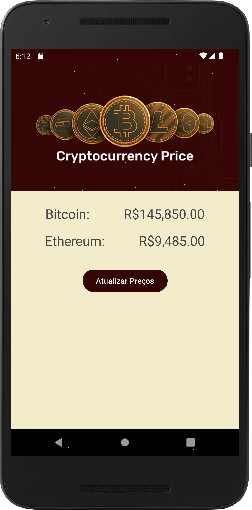

# Cotação de Criptomoedas

Um app que exibe a cotação (valor) atual de criptomoedas.

Autor: Guilherme Reis - [LinkedIn](https://www.linkedin.com/in/guilhermereisdev/)

### Recursos do app

- Exibe o preço atual das criptomoedas Bitcoin (BTC) e Ethereum (ETH).

### Técnicas utilizadas

- Conexão à [API do Mercado Bitcoin](https://www.mercadobitcoin.com.br/api-doc/) para acesso aos valores das criptomoedas.
- Retrofit2 como biblioteca de HTTP Client
- ViewBinding para buscar as views.

### Telas

_Clique na imagem para ver em tela cheia_

 
